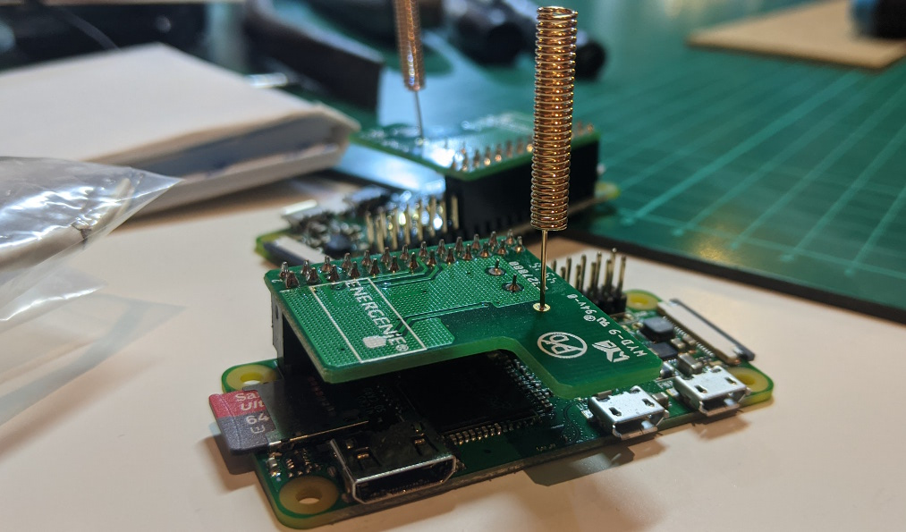

# Localwood

Control Energenie smart sockets via a Raspberry Pi using a web interface or API.

Adapted from: https://energenie4u.co.uk/res/pdfs/ENER314%20UM.pdf

## Requirements

- Python 3
- Raspberry Pi (I used a Zero W)
- [Energenie Pi-mote control board](https://energenie4u.co.uk/catalogue/product/ENER314)
- Web.py `pip3 install -r requirements.txt`

## Usage

1. Run server with: `python3 localwood.py`
2. Use web UI: http://localhost:8080

You can customise the socket names in the web interface using these environment variables:

```
SOCKET_1_LABEL="Desk lamp"
SOCKET_2_LABEL="Fairy Lights"
SOCKET_3_LABEL="Fan"
SOCKET_4_LABEL="Speakers"
```

You can also customise the page's heading with `PAGE_HEADING` and the web browser's tab title with `PAGE_TITLE`

## Recommendations

I'd recommend running this on the Pi as a [systemd service](https://www.raspberrypi.org/documentation/linux/usage/systemd.md), so it boots with the Pi. Here's [my systemd config](localwood.service) to get you started. If the systemd service fails to start use `journalctl -u localwood.service -n 40` to get the program's logs.

For accessing outside the house (e.g. with the Google Assistant) you can use IFTTT and ngrok. Alternatively you can use MQTT by running [this adaptor](https://github.com/The-Silverwood-Institute/Adorable-QTPI) to turn MQTT messages into Localwood API calls.

Soldering a 433MHz antenna to the Energenie control board can dramatically improve performance:



## Problems?

If you have problems or questions feel free to [open an issue](https://github.com/The-Silverwood-Institute/Localwood/issues/new). Pull requests always welcome :smile_cat:
