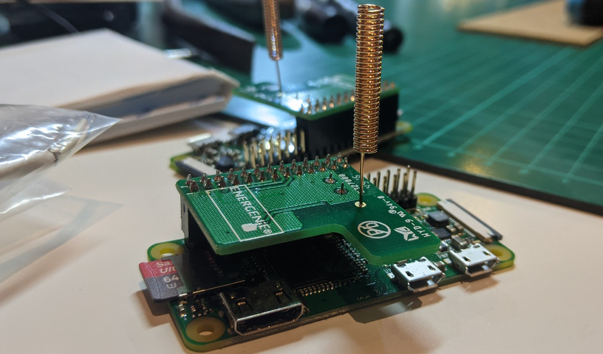

# Localwood

Control Energenie smart sockets via a Raspberry Pi using a web interface or API.

Adapted from: https://energenie4u.co.uk/res/pdfs/ENER314%20UM.pdf

## Requirements

- Python 3
- Raspberry Pi (I used a Zero W)
- [Energenie Pi-mote control board](https://energenie4u.co.uk/catalogue/product/ENER314)
- Flask and [rpi-lgpio](https://pypi.org/project/rpi-lgpio/) (a Bookworm-compatible `RPi.GPIO` shim): `pip3 install -r requirements.txt`

## Usage

1. Run server with: `python3 localwood.py`
2. Use web UI: http://localhost:8080

The server listens on `0.0.0.0:8080` so other devices on the LAN (MQTT/IFTTT adaptors, phones) can reach it.

Use environment variables to name each power socket. You can control up to 4 sockets.

Unnamed sockets will be hidden from the UI.

```
SOCKET_1_LABEL="Desk lamp"
SOCKET_2_LABEL="Fairy Lights"
SOCKET_3_LABEL="Fan"
SOCKET_4_LABEL="Speakers"
```

You can optionally customise the page's heading with `PAGE_HEADING` and the web browser's tab title with `PAGE_TITLE`.

### Authentication

Set `AUTH_TOKEN` to require a matching `token` query parameter on every request. If `AUTH_TOKEN` is unset, the UI and API are open. When it is set, a missing or invalid token returns HTTP 400.

### API

Turn sockets on or off with:

```
POST /sockets?socket=<1-4|all>&state=<on|off>
```

Include `&token=...` when `AUTH_TOKEN` is set. A successful request returns the plain text `Done`. Query string or form body both work.

## Recommendations

I'd recommend running this on the Pi as a [systemd service](https://www.raspberrypi.org/documentation/linux/usage/systemd.md), so it boots with the Pi. Here's [my systemd config](localwood.service) to get you started. If the systemd service fails to start use `journalctl -u localwood.service -n 40` to get the program's logs.

For accessing outside the house (e.g. with the Google Assistant) you can use IFTTT and ngrok. Alternatively you can use MQTT by running [this adaptor](https://github.com/The-Silverwood-Institute/Adorable-QTPI) to turn MQTT messages into Localwood API calls.

Soldering a 433MHz antenna to the Energenie control board can dramatically improve performance:



## Problems?

If you have problems or questions feel free to [open an issue](https://github.com/The-Silverwood-Institute/Localwood/issues/new). Pull requests always welcome :smile_cat:
